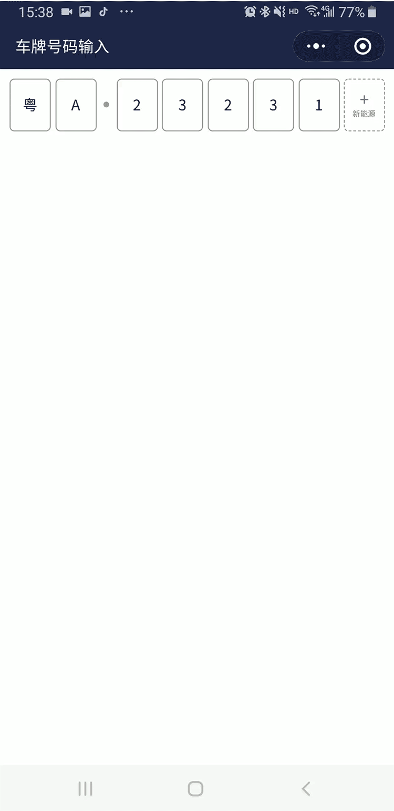

# wx-keyboard vue 虚拟键盘 车牌号码输入


## 效果图


 
## API

| 名称   | 类型             | 默认值                 | 描述  | 
| -------- | ---------------- | --------------------- | ---------- | 
| plateNumber | Array   | false     | 当前车牌号码    |

 


## Event

| 事件名   | 说明             | 返回值                 |
| -------- | ---------------- | --------------------- |
| change | 值发生变动时触发 | 当前plateNumber 值 |


-   使用

```html
<view class="container">
    <keyboard plateNumber="{{plateNumber}}" bind:change="onChange" ></keyboard>
</view>

```javascript

 Page({


  data: {
      show:true,
      plateNumber:"粤A23231".split('')
  },

  onChange(e){
     this.setData({
       plateNumber:e.detail
     })
     console.log(e.detail);
  }
  

})